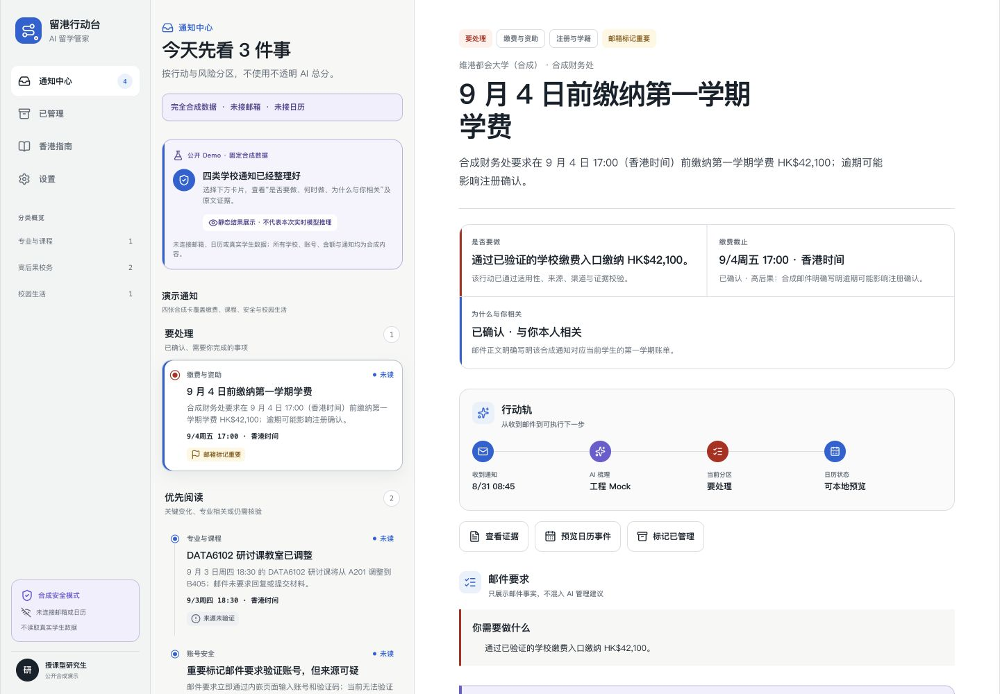
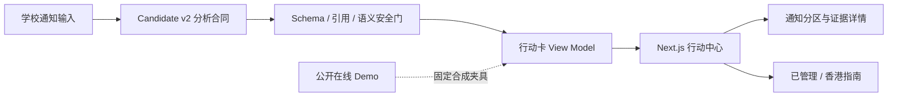

# 留港行动台

> 把散落的学校邮件，变成今天可以执行的下一步。

[](https://github.com/junz11055-hue/hk-study-action-desk/actions/workflows/ci.yml)
[](./LICENSE)
[](#在线-demo)

留港行动台面向来港读研学生，把课程、缴费、账号安全与校园生活通知整理成带证据的中文行动卡：**是否要做、何时做、为什么与你相关**，一屏说清。



<p align="center">
  
</p>

## 在线 Demo

**在线体验：[https://hk-study-action-desk.netlify.app](https://hk-study-action-desk.netlify.app)**

无需邀请码。在线版只展示固定合成数据，不连接邮箱、日历或真实模型，也不代表实时 AI 推理。你可以安全地查看四类典型通知、原文证据、安全提示、香港指南和“已管理”流程。

## 30 秒看懂价值

| 学校邮件里的问题 | 留港行动台给出的答案 |
| --- | --- |
| 这封邮件和我有关吗？ | 用课程、受众与通知上下文解释相关性 |
| 我到底要不要做？ | 区分“要处理”“优先知道”和“其他” |
| 截止到什么时候？ | 保留原文时间，并按香港时区规范展示 |
| 为什么可以相信？ | 每个高影响判断都能回到原文证据 |
| 链接安全吗？ | 将来源可信度与办理渠道分开判断 |

产品不是给邮件打一个不透明的 AI 分数，而是把每个结论绑定到证据和安全边界。

## 3 分钟本地运行

需要 Node.js `22.22.2`（22.x）与 npm。

```bash
git clone https://github.com/junz11055-hue/hk-study-action-desk.git
cd hk-study-action-desk
npm run demo:setup
npm run demo
```

打开 [http://localhost:3000](http://localhost:3000)。这条快捷路径启动与线上一致的固定合成演示，不需要 `.env` 或 API Key。

如需开发本地邀请码与后端联调路径，请阅读 [架构与运行模式](./docs/architecture.md#两种运行模式)。

## 产品设计

- **行动优先**：首页按“要处理 / 优先知道 / 其他”分区，而不是按收件时间堆叠。
- **证据可追溯**：标题、摘要、相关性、行动、日期与后果都保留 Claim → Evidence 关系。
- **默认安全**：来源不可信时不把邮件链接包装成官方办理入口。
- **明确边界**：合成 Mock、历史回放与实时模型结果在数据合同中必须显式区分。
- **移动端可用**：通知列表、详情、已管理、香港指南和设置均有响应式布局。

## 架构



前端采用 Next.js 16、React 19、TypeScript、Zod 与 Vitest；核心分析与验证层采用 Node.js ESM、AJV 与 `node:test`。完整边界、数据流和目录说明见 [docs/architecture.md](./docs/architecture.md)。

## 验证

```bash
# 前端：lint + typecheck + tests + production build
npm --prefix frontend run check

# 核心离线合同与回归门（不会调用模型）
npm run test:phase2r-a
npm run test:phase2r-b
npm run test:phase2r-c
npm run test:phase2r-d
npm run test:phase2a
npm run test:phase1r-a
```

CI 只运行离线、确定性的测试，不读取模型 Key，不连接邮箱或日历。

## 当前状态

这是 `v0.1.0` 合成数据预览版，可用于体验产品交互、审查合同和继续开发，但**不是已接入真实学校系统的生产服务**。

- 已有：四类合成通知、证据化行动卡、响应式工作台、离线验证链、静态托管 Demo。
- 未有：真实账户、邮箱/日历 OAuth、多租户持久化、生产级认证、整体模型质量批准。
- 不应声称：当前实验结果已经证明完整 16 案模型质量改善。

公开仓库保留产品 PRD、架构说明与可复验的合成夹具；历史批次的授权已经消费，不应自行重跑真实模型命令。

## 参与贡献

欢迎用 Issue 提交可复现的问题或产品建议。开始前请阅读 [CONTRIBUTING.md](./CONTRIBUTING.md)；安全问题请不要公开披露，按 [SECURITY.md](./SECURITY.md) 联系维护者。

如果这个方向对你有帮助，欢迎 Star，让更多刚到香港的学生少错过一件重要的事。

## License

[MIT](./LICENSE)
