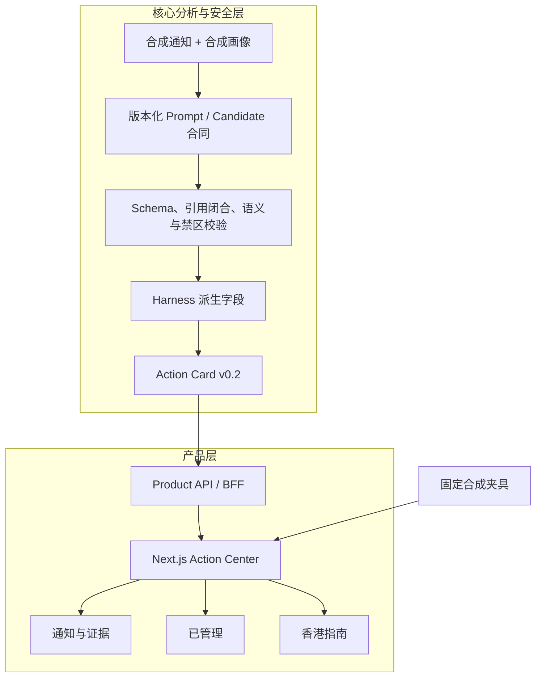

# 架构与运行模式

## 目标

留港行动台将学校通知转换为可追溯的行动卡。系统优先保证三件事：高影响结论有证据、来源和办理渠道不会混为一谈、演示模式不会伪装成生产能力。

## 数据流



核心验证器只接受或拒绝结果，不偷偷补写、纠正或用 preset 替换失败输出。前端只消费版本化 View Model，不直接渲染 Provider 原始输出。

## 两种运行模式

| 模式 | 启动方式 | 用途 | 边界 |
| --- | --- | --- | --- |
| 托管合成演示 | `npm run demo` 或 `DEMO_MODE=hosted` | GitHub/Netlify 公开体验 | 无邀请码、静态夹具、不请求模型或本机 API |
| 本地联调 | `npm --prefix frontend run dev` | 邀请会话、BFF 与本机 Product API 开发 | 需要 `.env`；Product API 仅允许 loopback |

公开 Demo 在服务端绕过本地邀请码页，直接渲染四张固定合成行动卡；动态分析槽位被替换为明确的静态展示说明。这避免了 Serverless 多实例下内存会话不一致，也避免在线页面误请求开发者本机服务。

本地联调模式保留邀请码会话、同源检查、HTTP-only Cookie、幂等任务提交和轮询。它不是生产身份系统。

## 目录

```text
frontend/
  app/                       Next.js App Router 页面与 Route Handlers
  features/action-center/    行动卡数据、模型、服务端适配与界面
  features/invite-access/    本地邀请码会话边界
  tests/                     Vitest 合同、组件与 HTTP 测试
src/
  v2/contracts/              Candidate 与 Evaluation Schema
  v2/product/                Action Card、Task 与 Product API
  v2/validation/             Canonical JSON 与候选结果校验
  v2/phase*/                 各阶段冻结的离线/实验运行器
test/                        Node.js 核心测试
docs/fixtures/               固定合成输入与 truth tables
```

## 关键合同

- Candidate：`notification-analysis-core-candidate-p1-v2`
- Action Card：`action-card-v0.2`
- 前端 View Model：`action-card-view-model/v0.2`
- 合成任务：`synthetic-analysis-task/v1`

旧合同保持不可变；破坏性变化通过新版本追加，不能原地改写。

## 部署

仓库根目录的 `netlify.toml` 将 Base 设为 `frontend/`，固定 Node 22，并在所有 Deploy Context 中开启 `DEMO_MODE=hosted`。Netlify 的 Next.js 适配负责 App Router 与 Route Handlers。

公开部署不需要 API Key、邀请码或 Product API 地址。若未来接入真实邮箱、日历、模型或账户系统，需要独立威胁建模、持久化会话、权限最小化和生产验收；不能只通过修改环境变量打开。
